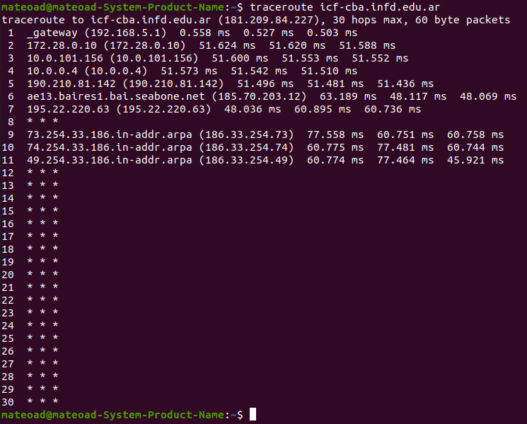
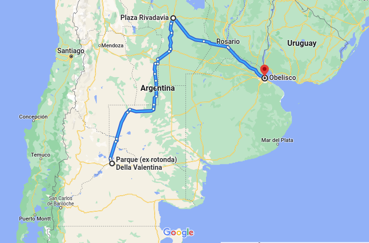
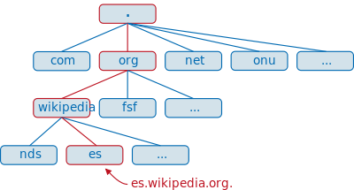
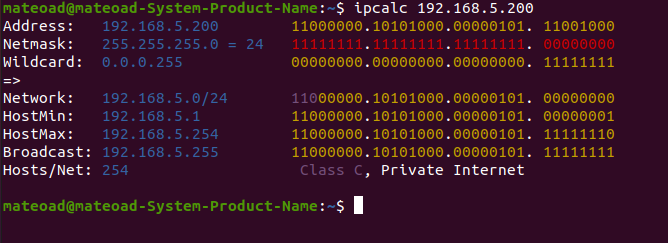
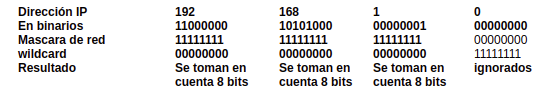
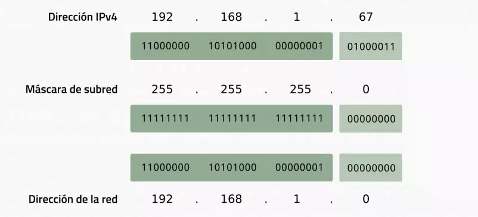
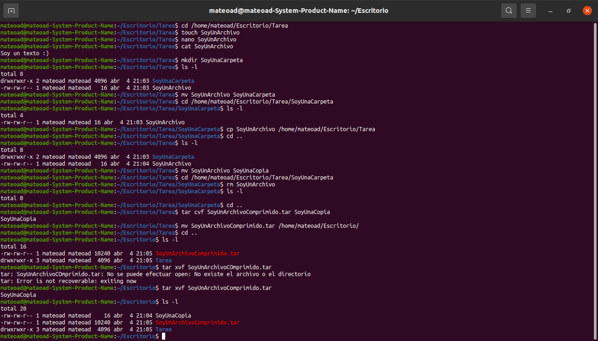
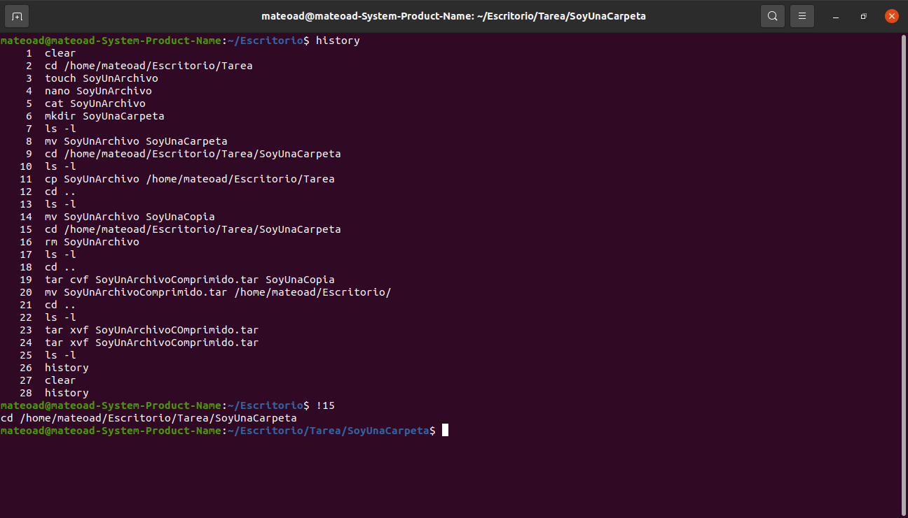

\#**TAREA PROGRAMA ACELERADOR**

**Alumno:**

-   Mateo Arévalo

[Tarea Nº 1](#id1)

[Tarea Nº 2](#id2)

### **Tarea Nº 1**`<a name="id1">`{=html}`</a>`{=html}

1.  Buscar diferencia entre ``IP`v4` y ``IP`v6`

**``IP`v4`** es la cuarta versión de `IP`, la cual establece las reglas para
que las redes de ordenadores funcionen según el principio del
intercambio de paquetes. Esta versión identifica de manera única los
dispositivos conectados a la red a través de un sistema de
direccionamiento. El ``IP`v4` utiliza un esquema de direcciones de `32 bits`
que permite almacenar `2^32` direcciones (4.19 mil millones de
direcciones). El aumento de los usuarios finales conectados a internet
ha provocado que se agoten las direcciones ``IP`v4`. Es por eso que el nuevo
sistema de direccionamiento de Internet: ``IP`v6`, se está desplegando para
satisfacer la necesidad de más direcciones de internet.

**``IP`v6`** se implementó en el año 2016 con la definición de su norma RFC
2460, y básicamente está destinado a sustituir cuando sea el caso, a
``IP`v4` de forma definitiva. Este estándar nació de la necesidad de darle a
los asiáticos más direcciones `IP`. A diferencia de las `IP`s ``IP`v4`, las ``IP`v6`
poseen una dirección `IP` de `128 bits` que admite `2^128` direcciones de
internet en total. El uso de ``IP`v6` no solo resuelve el problema de los
recursos limitados de direcciones, sino que también resuelve las
barreras para que múltiples dispositivos de acceso se conecten. Una
dirección ``IP`v6` se escribe así: `3ffe:1900:fe21:4545:0000:0000:0000:0000.`

Ahora con ``IP`v6` y estos `128` bits seremos capaces de direccionar un total
de:

**`2^128` = `340.282.366.920.938.463.463.374.607.431.768.211.456` hosts.**

1.  Investigar que es RTT

El **RTT** (tiempo de ida y vuelta, por sus siglas en inglés) o el RTD
(demora de ida y vuelta, por sus siglas en inglés) es el número de milisegundos que tarda una solicitud de red en llegar a un destino, como un
servidor, y volver a su punto de partida. Los administradores de red,
con este cálculo, determinan la latencia de la red y las velocidades de
conexión. En la RTT pueden influir diversos factores, tales como:

-   La distancia que tiene que recorrer la señal para llegar a su
    destino y volver a su punto de partida.
-   La cantidad de tráfico de la red.
-   El tiempo que tarda el servidor en responder a la solicitud de la
    red.

2.  Elegir una web, usar el comando `traceroute` y con Google Maps mapear
    las diferentes localizaciones que les dé la página
    <https://ip-api.com/>.

La página que elegí fue la del Instituto Contardo Ferrini
(<https://icf-cba.infd.edu.ar/>), la cual me dirigia desde Neuquen,
hasta Córdoba y por último a Buenos Aires. También por medio me mandó
hasta Italia, pero Google Maps no me dejaba conectar los cuatro lugares.

3.  Como esta estructurado el `DNS`.

El sistema de `DNS` en su conjunto está estructurado en forma de árbol, y
funciona como un sistema jerarquizado en donde un servidor preguntará a
otro, y este a otro a su vez, de forma recursiva, hasta poder atender
las peticiones de los clientes `DNS`.

-   **Resolutor recursivo:** El resolutor recursivo actúa como
    intermediario principal entre un ordenador y otros servidores `DNS`.
    Su propósito es reenviar una petición a otros servidores `DNS` y luego
    devolverla una vez completada. Cuando el resolutor recursivo recibe
    una petición, primero busca en su caché una dirección `IP` que
    coincida con el nombre de dominio. Si se encuentra esa dirección `IP`,
    la petición enviada a los servidores `DNS` termina aquí, y usted verá
    inmediatamente el sitio que quiere visitar. Sin embargo, si no
    encuentra ninguna coincidencia en su caché, el resolvedor recursivo
    enviará la solicitud al siguiente servidor `DNS`: el root nameserver.

-   **`DNS` root server:** El root server o `DNS` root server se encuentra
    en la cima de la jerarquía `DNS`. No guarda la información que buscas,
    que es la dirección `IP` que corresponde al nombre de dominio, pero da
    indicaciones de dónde puede encontrarse. Una vez que el root server
    recibe una petición del resolutor recursivo, identificará el dominio
    de nivel superior del nombre de dominio. Entonces, le dirá al
    resolutor recursivo que vaya al nameserver del TLD correcto.

-   **Servidor de nombres de dominio de nivel superior:** El servidor de
    nombres TLD es un servidor `DNS` responsable de almacenar y gestionar
    la información sobre los nombres de dominio que utilizan un dominio
    de nivel superior (TLD) específico. Un TLD es la última parte de un
    nombre de dominio, como .com, .org y .net. Si tu petición es la de
    encontrar la dirección `IP` de ejemplo.com, el root server redirigirá
    al resolutor recursivo al servidor de nombres TLD .com. Luego, el
    servidor de nombres TLD informará al resolutor sobre la ubicación de
    la dirección `IP` correspondiente en un servidor de nombres
    autoritativo específico.

-   **Servidor de nombres autoritativo:** El servidor de nombres
    autoritativo o servidor `DNS` autoritativo es la autoridad final en el
    proceso de resolución `DNS`. Almacena toda la información relacionada
    con el nombre de dominio que deseas visitar, incluida su dirección
    `IP`. El resolutor recursivo obtendrá la dirección `IP` y la enviará de
    nuevo a tu ordenador, dirigiéndote al sitio. Por último, el
    resolutor del sistema de nombres de dominio realiza el
    almacenamiento en caché de `DNS`, almacenando las direcciones `IP`
    recogidas de los servidores de nombres autoritativos como datos
    temporales. En otras palabras, el almacenamiento en caché del `DNS`
    hace que la próxima vez que quieras visitar el mismo sitio, sólo
    tendrá que devolver la coincidencia de la dirección `IP` obtenida
    anteriormente.

4.  Usar `ipcalc` en nuestra `IP` local (la obtenemos con el comando `ip a`). Ampliar los     conceptos de `wildcard`, netmask y `broadcast`.

**`wildcard`:** La máscara de `wildcard` es un registro de 32 bits de
longitud que, aplicado a una dirección ``IP`v4`, permite definir qué bits
son relevantes para la ejecución de una determinada acción y cuáles no
deben ser considerados o tenidos en cuenta:

-   Los bits significativos se señalan con `0` en la máscara de `wildcard`
-   Los bits no-significativos se marcan con `1` en la máscara de
    `wildcard`.

**`netmask`:** La máscara de subred señala qué bytes (o qué porción) de su
dirección es el identificador de la red. La máscara de red o redes es
una combinación de bits que sirve para delimitar el ámbito de una red de
ordenadores. Su función es indicar a los dispositivos qué parte de la
dirección `IP` es el número de la red, incluyendo la subred, y qué parte
es la correspondiente al host.

Partimos de la dirección `192.168.1.67` Si tenemos una máscara de subred
`255.255.255.0`, quiere decir que todas las direcciones tendrán como parte
fija `192.168.1` y el último octeto será que el presentará la variación.
Es decir, desde la `192.168.1.0` a `192.168.1.255`. De este rango, la
primera dirección se reserva para identificar la red, mientras que la
última queda reservada como dirección de `broadcast`.

**``broadcast``:** Una dirección de difusión amplia o `broadcast` es aquella
dirección `IP` que permite la transmisión de datos a una multitud de nodos
receptores contenidos en una misma subred y de forma simultánea. La
dirección de `broadcast` de cierta de dirección `IP`, será la dirección más
alta de la sub red que incluya dicha dirección `IP`.

Ejemplo: 
- Dirección `IP`: `210.1.1.100` 
- Subred: `210.1.1.96` - `210.1.1.127`
- Dirección de `broadcast`: `210.1.1.127`

5.  Investigar sobre ataques `DDoS`, como se elaboran y costos infligidos.

Un ataque de denegación de servicio distribuido (`DDoS`) es un intento
malintencionado de interrumpir el tráfico normal de un servidor,
servicio o red determinada, sobrecargando el objetivo o su
infraestructura asociada con una avalancha de tráfico de Internet. En
términos generales, un ataque `DDoS` es como un atasco de tráfico que
impide que llegues a tu destino.

La efectividad de los ataques `DDoS` reside en el uso de sistemas
informáticos vulnerables desde los que se origina el ataque de tráfico.
Entre los equipos afectados puede haber ordenadores y otros recursos de
red.

Los ataques `DDoS` se llevan a cabo con redes de equipos conectados a
Internet. Estas redes constan de ordenadores y otros dispositivos (como
dispositivos IoT) que han sido infectados con malware, lo que permite a
un atacante controlarlos de forma remota. Estos dispositivos
individuales se denominan **bots**, y un grupo de bots recibe el nombre de
**botnet** o red de bots.

Una vez que se ha establecido una red de bots, el atacante puede dirigir
un ataque enviando instrucciones remotas a cada bot. Debido a que cada
bot es un dispositivo legítimo de Internet, puede resultar complicado
disociar el ataque de tráfico del tráfico normal. Cuando el servidor o
la red de una víctima es el blanco de una red de bots, cada bot envía
solicitudes a la dirección `IP` del destino, lo que puede llegar a
sobrecargar el servidor o la red y, por consiguiente, provocar una
denegación de servicio al tráfico normal.

Un ejemplo de precios puede ser la siguiente imagen, pero estos pueden
escalar hasta sumas enormes, llegando a costar millones de dólares
dependiendo a que se ataque y en que medida.

(?)

6.  Investigar los tipos de `IP` y para que sirve cada uno.

Una dirección `IP` es un identificador único que se asigna a un equipo o
dispositivo electrónico cuando se conecta o trata de conectarse con otro
equipo o dispositivo. Los tipos de dirección `IP` que existen son cinco:

-   **Clase A:** Direcciones `IP` que van de la `0.0.0.0` a la
    `127.255.255.255`. **Estas direcciones `IP` se usan para redes grandes,
    generalmente de empresas internacionales.** El primer bloque numérico
    se usa para identificar a la red, mientras que los otros tres
    bloques numéricos se usan para identificar a los dispositivos de
    cada red (`RRR.DDD.DDD.DDD`). Esto permite crear 126 redes distintas y
    tener 16.777.214 dispositivos en cada red, es decir, pocas redes y
    muchos dispositivos por cada red que es justo lo que necesitan las
    empresas internacionales.

-   **Clase B:** Direcciones `IP` que van de la `128.0.0.0` a la
    `191.255.255.255`. **Estas direcciones `IP` se usan para redes de tamaño
    mediano, generalmente de empresas nacionales, instituciones o
    universidades.** Los dos primeros bloques numéricos se usan para
    identificar a la red, mientras que los otros dos bloques numéricos
    se usan para identificar a los dispositivos de cada red
    (`RRR.RRR.DDD.DDD`). Esto permite crear 16.384 redes distintas y tener
    65.534 dispositivos en cada red.

-   **Clase C:** Direcciones `IP` que van de la `192.0.0.0` a la
    `223.255.255.255`. **Estas direcciones `IP` se usan para redes de tamaño
    pequeño, generalmente empresas pequeñas o redes domesticas. Son las     direcciones `IP` que usamos el 99% de la población**. Los tres primeros
    bloques numéricos se usan para identificar a la red, mientras que el
    otro bloque numérico se usa para identificar a los dispositivos de
    cada red (`RRR.RRR.RRR.DDD`). Esto permite crear 2.097.152 redes
    distintas y tener 254 dispositivos en cada red, es decir, muchas
    redes y pocos dispositivos por cada red que es justo lo que
    necesitan las empresas pequeñas o lo que necesitamos nosotros en
    nuestras casas.

-   **Clase D:** Las direcciones de clase D se utilizan para
    aplicaciones de multidifusión. A diferencia de las clases
    anteriores, la Clase D no se utiliza para operaciones de red
    "comunes". Las direcciones de clase D tienen los primeros tres bits
    a `1` y el cuarto bit establecido a `0`. Las direcciones de clase D
    son direcciones de red de 32 bits, lo que significa que todos los
    valores que podemos encontrar en el rango `224.0.0.0` -
    `239.255.255.255` se utilizan para identificar grupos de multidifusión
    de forma única. No hay direcciones de host dentro del espacio de
    direcciones de clase D, puesto que todos los hosts dentro de un
    grupo comparten la dirección `IP` del grupo a la hora de recibir
    datagramas.

-   **Clase E:** Las redes de clase E se definen marcando los primeros
    cuatro bits de la dirección de red a `1`, lo que genera las
    direcciones que van desde `240.0.0.0` a `255.255.255.255`. A pesar de
    que esta clase está reservada, nunca se definió su uso, por lo que
    la mayoría de las implementaciones de red descartan estas
    direcciones como ilegales o indefinidas, a excepción, claro está, de
    `255.255.255.255`, que se utiliza como una dirección de difusión
    (`broadcast`).
    
7.  Entrar a <https://www.cual-es-mi-ip.net/> y ver cual es su `IP`
    pública, ponerla en <https://query.milacnic.lacnic.net/home> y
    averiguar a quien le pertenece.

Mi `IP` en este momento es `190.210.81.128/28` y está bajo el nombre de la
empresa **Krillcom SRL** (ID AR-FOMA-LACNIC)

### **Tarea Nº 2**`<a name="id2">`{=html}`</a>`{=html}

