# **Cómo instalar `Ubuntu` y configurar un Dual Boot**

## *Tutorial APB (A Prueba de Boludos)*

**GRUPO:**

- Mateo Arévalo
- Ignacio Bressan

**INDICE:**

1. [Instalación de `Ubuntu`](#id1)
2. [Configuración del Dual Boot](#id2)
3. [Solución a posibles problemas](#id3)

**¿Qué es `Ubuntu`?**

`Ubuntu` - creado por el sudafricano Mark Shuttleworth - es un sistema
operativo enfocado en dispositivos electrónicos, construido a partir del
núcleo Linux (Linux Kernel). `Ubuntu` es una distribución de GNU/Linux,
lanzado en el año 2004 por la empresa Canonical.

`Ubuntu`, se caracteriza por sus principales ventajas como:

- Gratuito, se puede descargar gratuitamente para empezar a disfrutar
    del paquete de programas que ofrece. Es de destacar, que obtiene
    ingresos a través de servicios, como el servicio técnico.
- Sistema libre basado en el Debian y sigue las normas del software
    abierto, por lo que se puede usar en cualquier dispositivo
    electrónico sin ninguna restricción en su licencia.
- Simplifica el manejo de aparatos electrónicos para fines personales
    o profesionales.
- Incluye un conjunto de programas como: pidgin para mensajería
    instantánea (msn, yahoo, gtalk), navegador web, ofimática,
    audio/vídeo, juegos, imagen (retoques), thunderbird, programas de
    edición de texto, entre otros.

### **INSTALACIÓN DE `Ubuntu`**`<a name="id1">`{=html}`</a>`{=html}

1. Descargar `Ubuntu`

Para descargar `Ubuntu` debemos ir a la página oficial del sistema:

- [`Ubuntu`](https://`Ubuntu`.com/download/desktop)

Allí seleccionaremos la opción de `Ubuntu` 20.04.4 LTS, la cual nos otorga
un soporte y mantenimiento del sistema hasta el 2025:

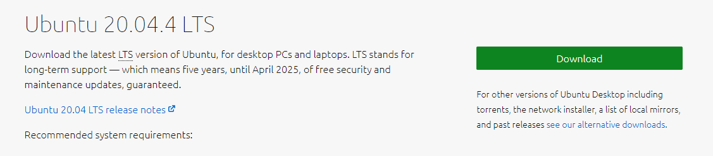

1. Descargar Rufus

Mientras `Ubuntu` se descarga podemos ir y descargar una herramienta
necesaria para la instalación, para la cual necesitaremos un pendrive:

- [Rufus](https://rufus.ie/es/)

Esta aplicación lo que hará sera leer el ISO de `Ubuntu` y lo \"quemará\"
en nuestro pendrive **(AVISO: Todos los archivos dentro del USB se
borrarán)**

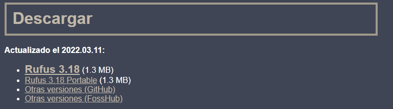

Seleccionamos la primera opción **Rufus 3.18 (1.3 MB)** y lo descargamos.

# Proceso de instalación de `Ubuntu` en nuestra pc

4. Apagaremos la pc, desconectaremos los discos y solo dejaremos el
disco en el cual vamos a instalar `Ubuntu` y dejamos conectado el pendrive
con el ISO. (?)

Si hemos seguido los pasos anteriores correctamente, `Ubuntu` al ser
bastante mas facil de instalar, se cargara solo...

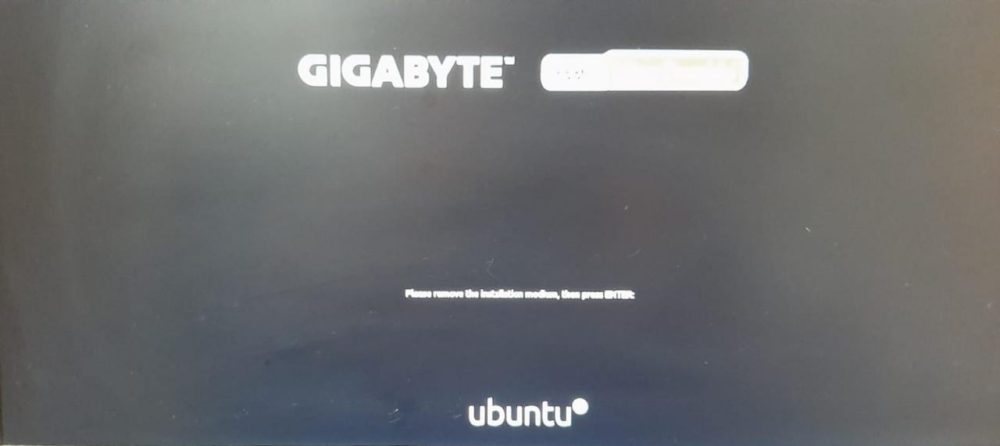

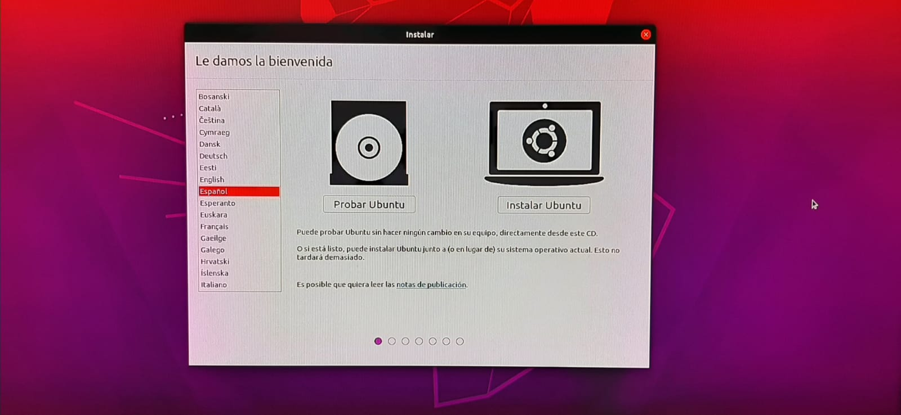

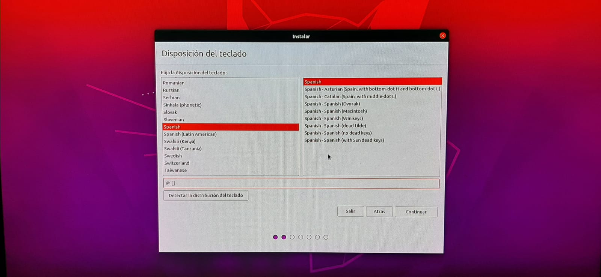

6- Elegiremos el la disposicion de nuestro teclado y probaremos en la
bbara de abajo los caracteres que ya estamos acostumbrados a utilizar.

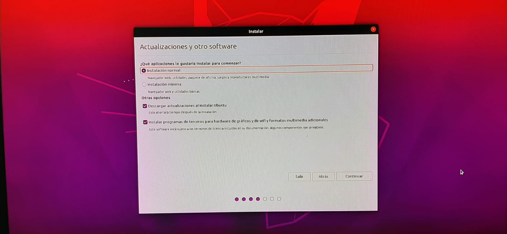

7-En nuestro caso elegimos la intalación normal pero si usted cuenta con
poco espacio, podemos recomendarle que elija la instalacion minima.

**AVISO:** Si quiere realizar un [dual boot](#id2) deberá saltar a la
segunda parte.

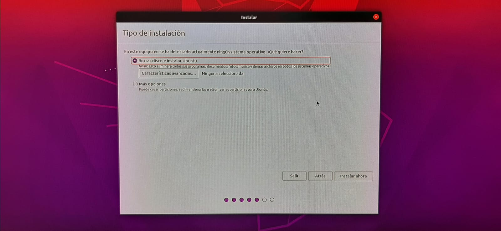

8-En este paso, nosotros elegimos eliminar el disco, ya que en nuestro
caso ya estaba vacio de ante mano pero si usted cuenta con cosas en su
disco le recomendamos hacer un backup o pasar sus archivos importante a
un pendrive diferente del q usara para la instalación.

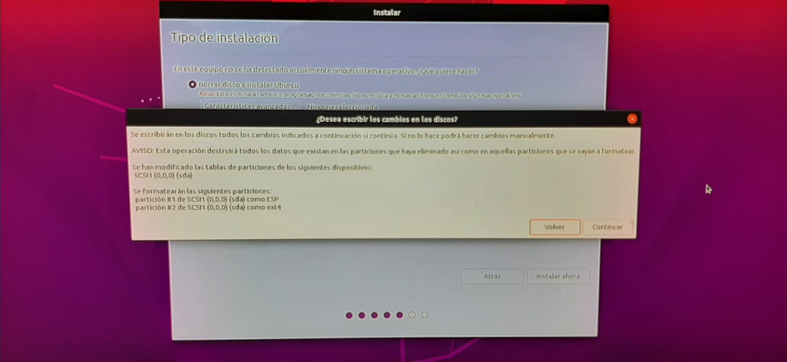

Por precaución `Ubuntu` nos avisara de esto\...

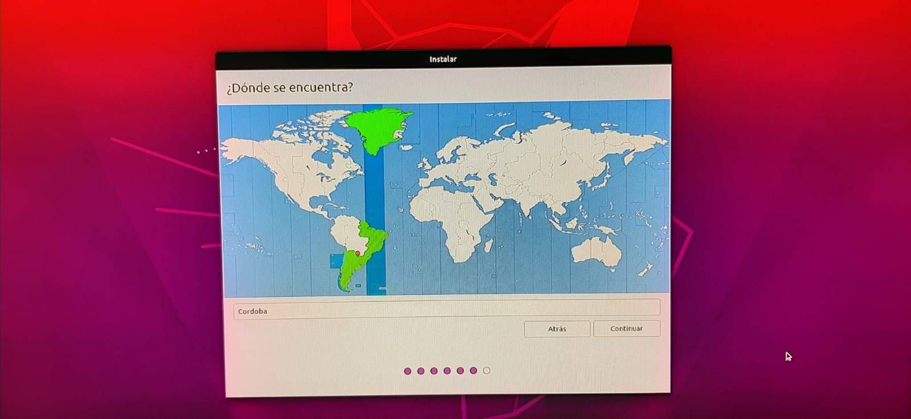

9-`Ubuntu` por nuestra IP reconocera nuestra ubicacion para poder
brindarnos nuestra zona horaria, pero usted tiene la posibilidad de
cambiarla.

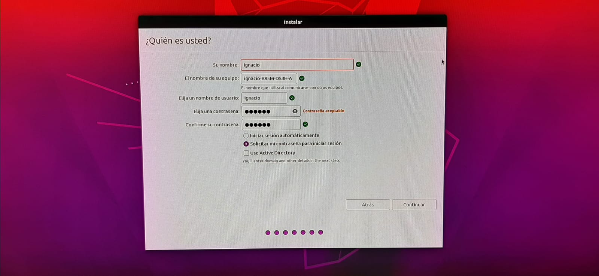

10-Cargaremos nuestro Usuario y elegiremos una contraseña, esto queda a
elección de cado uno\...

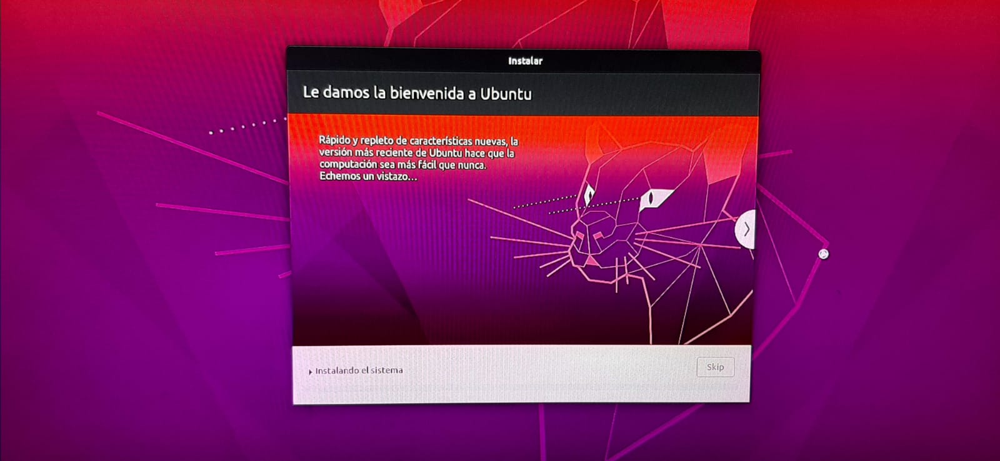

Al darle contuniar se instalara el `Ubuntu` y deberemos dejarlo unos
minutos\...

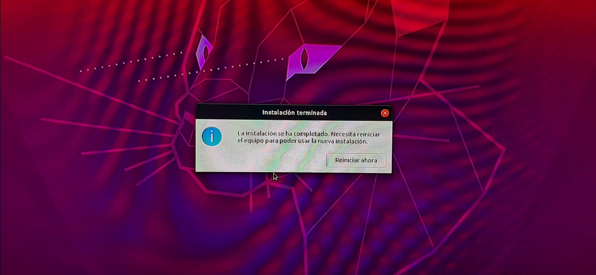

11-Se nos abrira el sieguiente cartel una vez la intalación se haya
completado con exito, deberemos reiniciar la pc.

12-Una vez se haya reiniciado, tendremos `Ubuntu` para disfrutar\...

### **CONFIGURACIÓN DEL DUAL BOOT**`<a name="id2">`{=html}`</a>`{=html}

1. Elegir la opción \"más opciones\"

Haremos click en la tercera opción para poder configurar el disco donde
se encuentra `Ubuntu`:

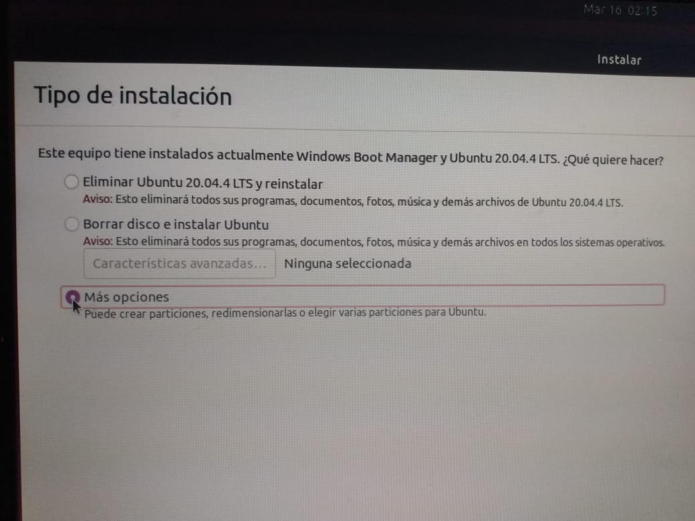

1. Elegir el disco donde se encuentra `Ubuntu`

En esta parte deberemos ser muy cuidados, es la parte más riesgosa de
este corto proceso, ya que si elegimos el disco donde está `Windows` y lo
borramos perderemos todo (sistema, archivos, imagenes, etc.)

Una forma de darnos cuenta cuál es nuestro disco para `Ubuntu` deberíamos
ver de antemano la cantidad de espacio que tiene, sabiendo así
reconocerlo más tarde. Igualmente debería ser espacio libre el que haya.

En mi caso es el segundo disco, llamado `/dev/sdb`

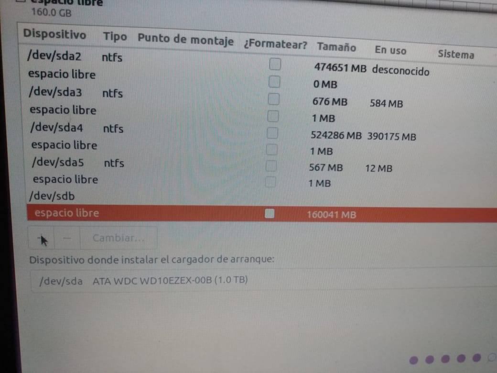

1. Formateo del disco

Una vez seleccionado lo que haremos será crear nuevas particiones dentro
del mismo, lo que terminará **BORRANDO TODO DENTRO DEL DISCO**.
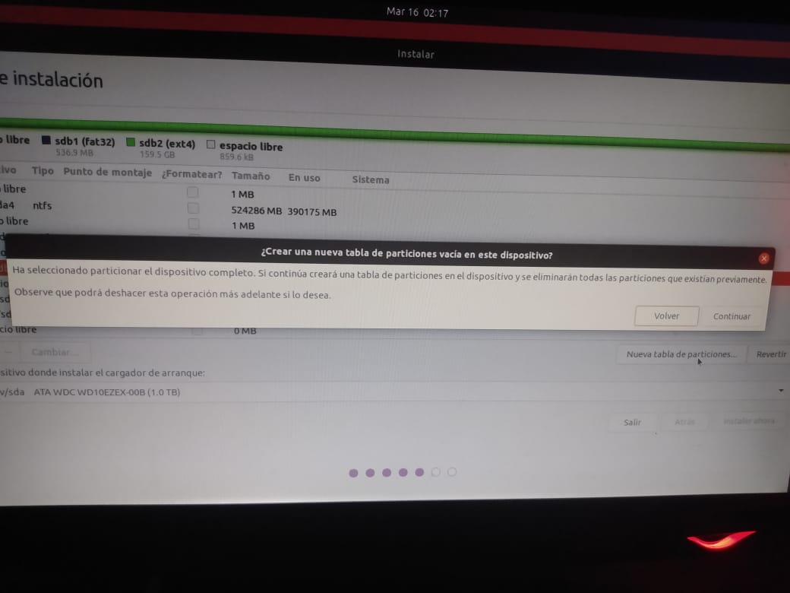

1. Creación de particiones

Una vez que borramos todo dentro del disco lo que haremos será crear
tres particiones, dandole al botón de +. Allí crearemos las particiones
root:`/` y home:`/home`.

La partición / será donde se instalará `Ubuntu`, así que si en caso de que
el sistema se corrompa no perderemos nuestros archivos, ya que estarán
en la partición `/home`.

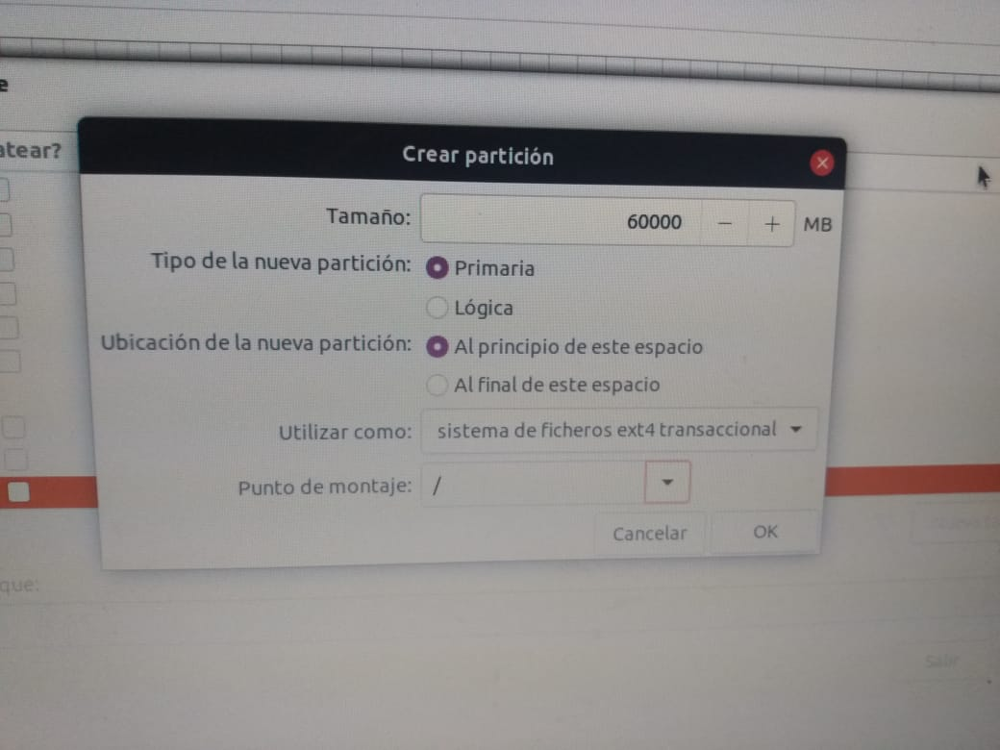

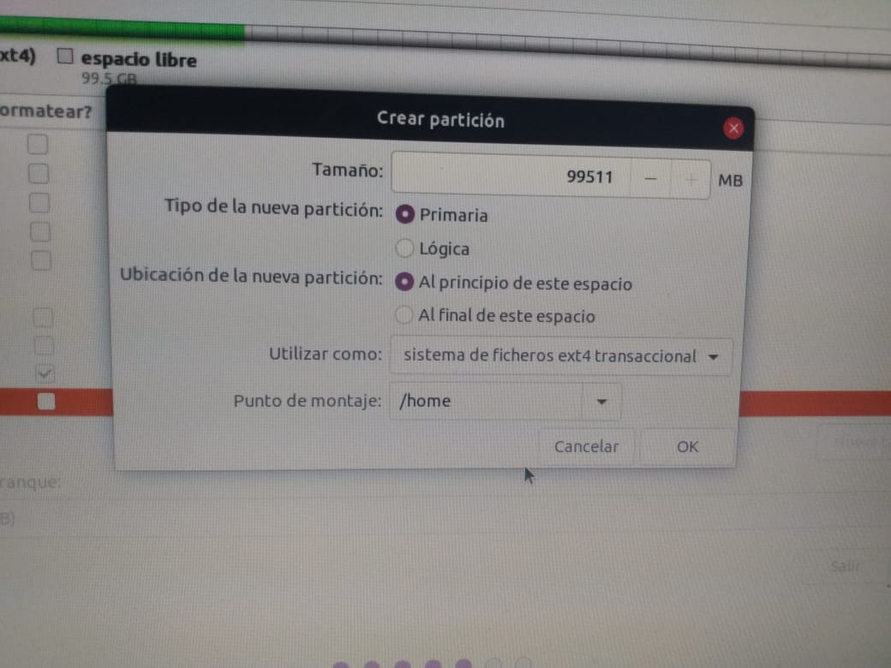

1. Asignar disco de arranque

Es importante para que funcione el dual boot el seleccionar el disco de
`Ubuntu` como el cargador de arranque. En caso de instalarlo en el disco
de `Windows` fallará y el dual boot no servirá.

Una vez que hayamos terminado le damos a instalar y listo. Disfruta de
tu dual boot!

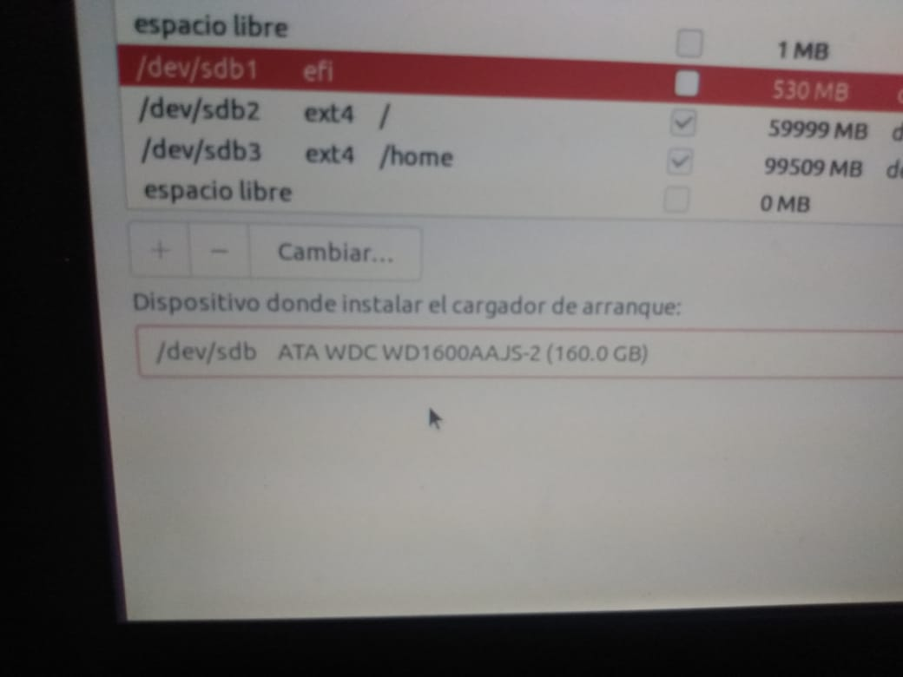

### **Solución a posibles problemas**`<a name="id3">`{=html}`</a>`{=html}

A mi, Mateo Arévalo, se me presentó el problema de que el dual boot no
funcionaba. Lo que sucedia es que había instalado `Ubuntu` con un formato
de archivos diferente al que usa `Windows`, lo que causó que la
configuración de la BIOS cambie y no pueda iniciar `Windows`. La solución
fue formatear el disco donde se encontraba `Ubuntu` e instalarlo de nuevo
con el tipo de archivo correcto (esto se cambia desde una opción en
Rufus)

Otro problema que se me presentó fue que durante un día el cable
ethernet no me lo reconocía, solución? Ninguna, se arregló solo :D